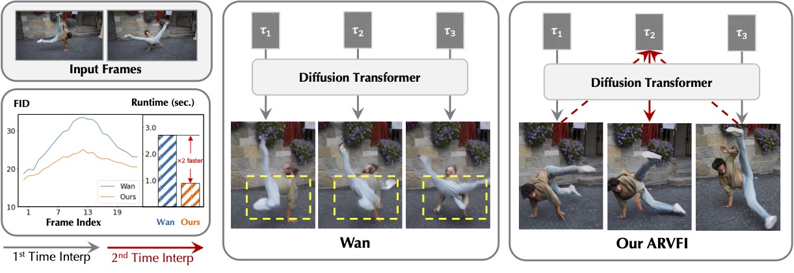

# Bi-directional Autoregressive Diffusion for Large Complex Motion Interpolation

CVPR 2026 Accepted Paper

Yongrui Ma, Shijie Zhao, Mingde Yao, Junlin Li, Li Zhang, Xiaohong Liu, Qi Dou, Jinwei Gu, Tianfan Xue

[[Home Page](https://mayongrui.github.io/ARVFI/)] [[Code](https://github.com/Mayongrui/ARVFI/tree/master)] [[Paper]()]

Please contact Yongrui Ma at yongrayma@gmail.com for more information.

## Action List
- [ ] Arxiv/ICLR paper link release
- [ ] Evaluation
- [ ] Evaluation code release 

## Teaser Figure

    The proposed ARVFI interpolates a sequence frame based on previous predictions, while the current full-sequence interpolation method, such as Wan, generates all intermediate frames simultaneously. This bidirectional autoregressive interpolation scheme mitigates increasing FID errors as frames move away from the input frames and generates more continuous and consistent results, as shown in the bottom left figure. Additionally, because a frame is predicted based on all previous interpolation results, the diffusion network can interpolate with fewer diffusion sampling steps and superior efficiency. Our RDVFI accelerates Wan by 3x with higher interpolation accuracy (FID score in the bottom left figure) and visual quality (see yellow boxes).

## Abstract
Despite recent progress, diffusion-based video frame interpolation methods still struggle with large, complex motions, resulting in discontinuous motions and inconsistent object appearances across frames. We observe that these limitations arise from both the current full-sequence interpolation strategy and the pixel reconstruction training objective. To solve these challenges, we propose ARVFI, a novel video diffusion-based interpolation method for large complex motion interpolation. Instead of generating all intermediate frames simultaneously, ARVFI interpolates in an autoregressive manner from two input frames to the middle ones. Thus, ARVFI interpolates a frame that is further away from the inputs based on all previous interpolation results, resulting in smoother motion transitions and better temporal consistency. Additionally, ARVFI further utilizes DINOv3 features as motion representations, which provide high-level semantics for accurate motion estimation, compared with a simple pixel-level loss. 
With all these designs, ARVFI generates the intermediate DINOv3 features first and then the frames with an effective conditional generation method for frames. Our ARVFI consistently outperforms existing methods with superior interpolation accuracy and visual quality.