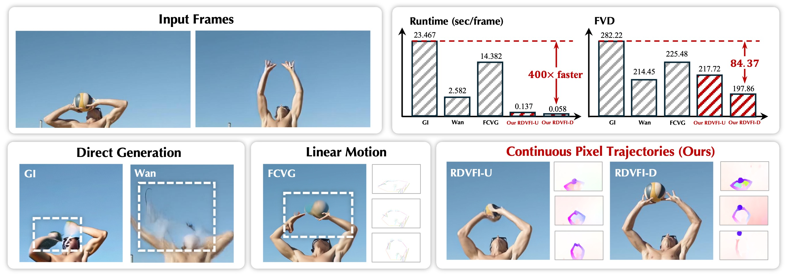

# Realtime Video Frame Interpolation Using One-Step Diffusion Sampling

ICLR 2026 Accepted Paper

Yongrui Ma, Shijie Zhao, Mingde Yao, Junlin Li, Li Zhang, Xiaohong Liu, Qi Dou, Jinwei Gu, Tianfan Xue

[[Home Page](https://mayongrui.github.io/RDVFI/)] [[Code](https://github.com/Mayongrui/RDVFI/tree/master)] [[Paper](https://openreview.net/pdf?id=OiWyf1BNtC)]

Please contact Yongrui Ma at yongrayma@gmail.com for more information.

## Action List
- [ ] Arxiv/ICLR paper link release
- [ ] Evaluation
- [ ] Evaluation code release 

## Teaser Figure

Video frame interpolation results of the proposed Unet-based RDVFI-U and DiT-based RDVFI-D with comparisons to state-of-the-art methods. RDVFI produces the most visually pleasant and the best numeric results with a $400\times$ acceleration, owing to more proper modeling of the intermediate motions using the high-order continuous pixel trajectories, compared with previous direct frame-generation methods, and linear motion controls. 

## Abstract
Video Frame Interpolation (VFI) involving large, complex motions remains a significant challenge due to the difficulty of modeling diverse pixel trajectories from limited inputs. Traditional methods struggle with low-order approximations, and recent Latent Video Diffusion Models (LVDM) improve it through a conditional generation modeling. Still, current LVDMs often prioritize pixel fidelity over motion coherence in their reconstruction objective, leading to artifacts in extreme motion scenarios. To address this, we propose RDVFI, a novel approach that leverages an LVDM to generate sparse latent keyframes which define high-order, continuous pixel trajectories. The estimated continuous pixel trajectories accurately index pixel movements from inputs to arbitrary timestamps, generating optical flows to warp input pixels into the target frame. By decoupling sequence motion generation from high-resolution rendering, RDVFI operates on a fixed, lower resolution, and fewer diffusion sampling steps, introducing significant efficiency gains. Extensive experiments demonstrate that RDVFI achieves state-of-the-art visual and numerical performance, with over 75\% of viewers selecting it as the best method in terms of motion and frame quality compared to leading baselines. Furthermore, RDVFI is the first LVDM-based VFI method to achieve real-time performance (17 FPS at $1024\times 576$), offering a $\times 44$ acceleration over the current state-of-the-art and also robustly handling challenging motions. 